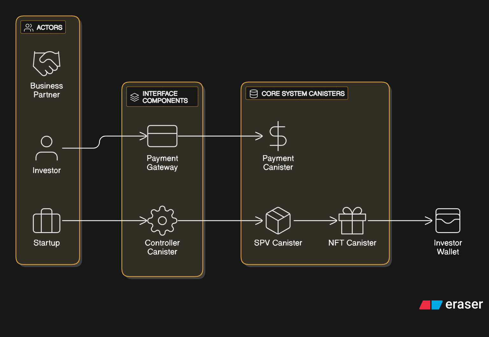
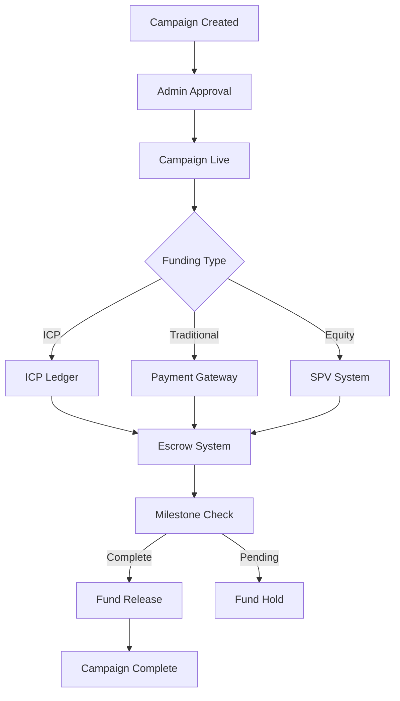

# 🚀 FundVerse - Decentralized Crowdfunding Platform

<div align="center">
  
  
  [](https://internetcomputer.org/)
  [](https://www.rust-lang.org/)
  [](https://reactjs.org/)
  [](https://www.typescriptlang.org/)
</div>

## 💡 Idea Brief

**FundVerse** is a revolutionary decentralized crowdfunding platform built on the Internet Computer (IC) that bridges traditional and crypto funding methods. It enables entrepreneurs to raise capital through multiple channels while providing investors with diverse investment opportunities including equity participation via Special Purpose Vehicles (SPVs).

### 🎯 Core Vision
- **Unified Funding**: Seamlessly integrate ICP cryptocurrency, traditional payment methods, and equity investments
- **Decentralized Governance**: Community-driven campaign approval and management
- **Transparent Operations**: All transactions and governance decisions recorded on-chain
- **Global Accessibility**: Support for multiple currencies and payment methods worldwide

### 🌟 Key Features
- **Multi-Channel Funding**: ICP, credit cards, bank transfers, and digital wallets
- **Equity Investments**: SPV-based equity participation with tokenized certificates
- **Campaign Management**: Comprehensive project lifecycle from creation to completion
- **Admin Governance**: Decentralized approval system for campaign quality control
- **Real-time Analytics**: Live funding tracking and campaign performance metrics

## 🏗️ How It Works

### Architecture Overview
FundVerse operates as a multi-canister system on the Internet Computer, with each canister handling specific functionality:

```
┌─────────────────┐    ┌─────────────────┐    ┌─────────────────┐
│   Frontend      │    │   Backend       │    │   Admin         │
│   (React/TS)    │◄──►│   (Rust)        │◄──►│   (Rust)        │
└─────────────────┘    └─────────────────┘    └─────────────────┘
         │                       │                       │
         │              ┌─────────────────┐              │
         │              │   Fund Flow     │              │
         │              │   (Rust)        │              │
         │              └─────────────────┘              │
         │                       │                       │
┌─────────────────┐    ┌─────────────────┐    ┌─────────────────┐
│   Controller    │    │   SPV           │    │   Payment       │
│   (Rust)        │◄──►│   (Rust)        │    │   Gateway       │
└─────────────────┘    └─────────────────┘    │   (Rust)        │
         │                       │            └─────────────────┘
         │              ┌─────────────────┐              │
         └──────────────►│   SPV Token     │◄─────────────┘
                        │   (Rust)        │
                        └─────────────────┘
```

### User Journey

1. **Campaign Creation**: Entrepreneurs create detailed campaign proposals
2. **Admin Review**: Community admins review and approve campaigns
3. **Multi-Channel Funding**: 
   - ICP contributions via Internet Computer
   - Traditional payments via PaymentGateway
   - Equity investments via SPV system
4. **Milestone Tracking**: Campaign progress monitored through milestones
5. **Fund Distribution**: Automatic fund release based on milestone completion

### Funding Flow



## 🛠️ Technology Stack

### Backend (Internet Computer Canisters)
- **Language**: Rust
- **Framework**: IC CDK (Internet Computer Development Kit)
- **Storage**: StableBTreeMap, HashMap for persistent data
- **Inter-canister Communication**: Asynchronous calls with Candid interfaces

### Frontend
- **Framework**: React 18.3.1
- **Language**: TypeScript 5.9.2
- **Build Tool**: Vite 4.3.9
- **Styling**: Tailwind CSS 3.3.0
- **UI Components**: Radix UI primitives
- **Forms**: React Hook Form with Zod validation
- **Charts**: Recharts for analytics
- **Animations**: Framer Motion

### Internet Computer Integration
- **Authentication**: Internet Identity
- **Agent**: @dfinity/agent for canister communication
- **Candid**: Interface definition language for canister APIs
- **Principal**: User and canister identity management

### Development Tools
- **Package Manager**: npm workspaces
- **Code Formatting**: Prettier
- **Type Checking**: TypeScript strict mode
- **Build System**: dfx (Internet Computer SDK)

## 💼 Business Model

### Revenue Streams

1. **Platform Fees**
   - 2-5% fee on successful campaigns
   - Tiered pricing based on campaign size
   - Premium features for enterprise users

2. **Payment Processing**
   - Transaction fees on traditional payments
   - Currency conversion fees
   - Cross-border payment processing

3. **SPV Management**
   - Setup fees for equity investment structures
   - Ongoing management fees for SPV operations
   - Legal compliance and documentation services

4. **Premium Services**
   - Campaign marketing and promotion
   - Legal and compliance consulting
   - Advanced analytics and reporting

### Value Proposition

**For Entrepreneurs:**
- Access to global funding sources
- Reduced barriers to capital raising
- Transparent and secure platform
- Professional campaign management tools

**For Investors:**
- Diversified investment opportunities
- Transparent project information
- Secure escrow system
- Equity participation options

**For the Platform:**
- Sustainable revenue model
- Scalable technology infrastructure
- Global market reach
- Network effects with user growth

## 🚀 Getting Started

### Prerequisites

- **Node.js**: >= 16.0.0
- **npm**: >= 7.0.0
- **Rust**: Latest stable version
- **dfx**: Internet Computer SDK
- **Git**: For version control

### Installation

1. **Clone the Repository**
   ```bash
   git clone <repository-url>
   cd FundVerse
   ```

2. **Install Dependencies**
   ```bash
   npm install
   ```

3. **Install Internet Computer SDK**
   ```bash
   sh -ci "$(curl -fsSL https://internetcomputer.org/install.sh)"
   ```

4. **Start Local Internet Computer**
   ```bash
   dfx start --background
   ```

5. **Deploy Canisters**
   ```bash
   dfx deploy
   ```

6. **Start Frontend Development Server**
   ```bash
   cd src/FundVerse_frontend
   npm run dev
   ```

### Development Commands

```bash
# Start local IC replica
dfx start --background

# Deploy all canisters
dfx deploy

# Generate Candid interfaces
dfx generate

# Build frontend
npm run build

# Start development server
npm run dev

# Run tests
npm test

# Format code
npm run format
```

### Environment Setup

1. **Local Development**
   - Frontend: `http://localhost:3000`
   - IC Replica: `http://localhost:4943`
   - Internet Identity: `http://localhost:4943?canisterId=rdmx6-jaaaa-aaaaa-aaadq-cai`

2. **Production Deployment**
   - Deploy to Internet Computer mainnet
   - Configure environment variables
   - Set up monitoring and analytics

### Canister Configuration

The project includes multiple canisters:

- **FundVerse_backend**: Core campaign and user management
- **Fund_Flow**: ICP funding and escrow system
- **Admin**: Campaign approval and governance
- **Controller**: SPV management and control
- **SPV**: Special Purpose Vehicle operations
- **Spv_Token**: Equity token management
- **PaymentGateway**: Traditional payment processing
- **FundVerse_frontend**: React frontend application

### Troubleshooting

**Common Issues:**

1. **Canister Connection Errors**
   - Ensure all canisters are deployed: `dfx deploy`
   - Check canister status in the UI
   - Use the "Setup" button to reconnect canisters

2. **Payment Gateway Issues**
   - Verify PaymentGateway canister is deployed
   - Check canister status indicators
   - Ensure proper form validation

3. **Build Errors**
   - Run `dfx generate` before building
   - Clear node_modules and reinstall: `rm -rf node_modules && npm install`
   - Check TypeScript errors: `npm run build`

## 📚 Documentation

- [Integration Guide](./INTEGRATION_GUIDE.md) - Backend canister integration
- [Frontend Integration Guide](./FRONTEND_INTEGRATION_GUIDE.md) - Frontend development
- [ICP Funding README](./ICP_FUNDING_README.md) - ICP integration details

## 🤝 Contributing

1. Fork the repository
2. Create a feature branch: `git checkout -b feature/amazing-feature`
3. Commit changes: `git commit -m 'Add amazing feature'`
4. Push to branch: `git push origin feature/amazing-feature`
5. Open a Pull Request

## 📄 License

This project is licensed under the MIT License - see the [LICENSE](LICENSE) file for details.

## 🔗 Links

- [Internet Computer Documentation](https://internetcomputer.org/docs)
- [Rust Documentation](https://doc.rust-lang.org/)
- [React Documentation](https://reactjs.org/docs)
- [TypeScript Documentation](https://www.typescriptlang.org/docs)

---

<div align="center">
  <p>Built with ❤️ on the Internet Computer</p>
  <p>© 2025 FundVerse. All rights reserved.</p>
</div>